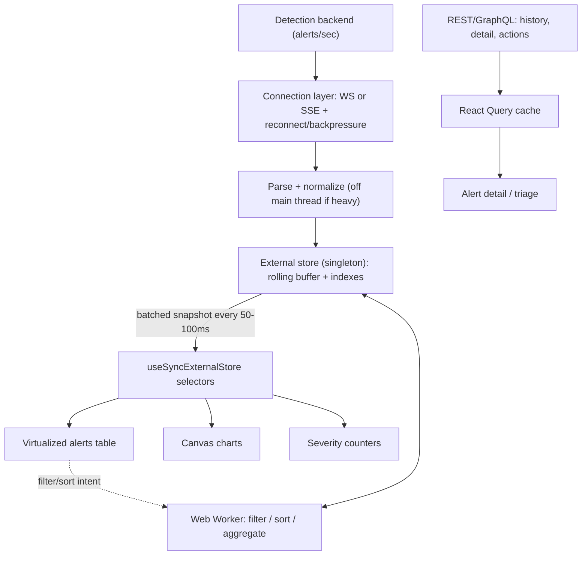

# Frontend System Design: Real-time SOC Alerts Dashboard (Cortex/XSIAM-flavored)

A worked answer. The single most important idea to land: **keep the high-frequency stream
out of React's render path** and let components subscribe to batched snapshots. Everything
else (virtualization, workers, memoization) hangs off that.

> Prompt: "Design the frontend for a SOC dashboard that shows security alerts streaming
> in real time. Analysts triage, filter, search, and drill into thousands of alerts."

---

## 1. Clarify (always start here, ~3–5 min)

- **Scale**: how many alerts/sec at peak? (assume bursts to ~thousands/sec) Total live in
  view? (assume a rolling window of 10k–50k). This drives virtualization + buffering.
- **Latency need**: "real time" = sub-second visible, but analysts can't read 1000/sec —
  so we update the UI 4–10x/sec, not per event.
- **Users/tenancy**: multi-tenant SOC; per-tenant data isolation; RBAC on actions.
- **Views**: live alerts table, severity/timeline charts, alert detail, triage actions
  (ack/assign/close), saved filters. Roughly 5–8 screens.
- **Transport available**: WebSocket vs SSE vs polling? GraphQL subscriptions?
- **Constraints**: must stay responsive during bursts; accessible (analysts live in it);
  reconnect gracefully (analysts can't miss alerts).

## 2. High-level architecture



Two data planes:
- **Live plane** (push): stream → store → batched snapshots → views. Not React state.
- **Request plane** (pull): history, alert detail, mutations (ack/assign) → React Query
  (or Apollo) with normalized cache, retries, optimistic updates.

## 3. The core decision: stream data out of React

Putting socket messages into `useState`/Redux re-renders the tree on every event and melts
the UI during bursts. Instead:

- A **singleton store** (plain module / class, or Zustand) holds the rolling buffer.
- The connection layer writes incoming alerts into the store and marks it dirty.
- A scheduler **flushes batched updates** on a `requestAnimationFrame` loop or a 50–100ms
  interval (coalesces a burst of N events into one notify).
- Components read via **`useSyncExternalStore(subscribe, getSnapshot)`** with **selectors**
  so a component only re-renders when *its* slice changes (e.g. the critical-count badge
  doesn't re-render when a low-severity row updates).

```ts
// sketch
const store = createAlertStore({ capacity: 20_000 }); // rolling buffer, drops oldest
socket.onMessage = (raw) => store.enqueue(normalize(raw)); // no React involved
// flush loop coalesces bursts -> one notify per frame/tick
function useCriticalCount() {
  return useSyncExternalStore(store.subscribe, () => store.criticalCount);
}
```

- **Rolling buffer cap** bounds memory and keeps update cost O(window), not O(all-time).
- **Backpressure**: if events arrive faster than we can flush, coalesce/drop within the
  buffer (keep newest, or aggregate counts) rather than queueing unboundedly.

## 4. Rendering the large table

- **Virtualization** (`@tanstack/react-virtual` or hand-rolled windowing): render only
  visible rows + overscan. Be ready to derive `startIndex/endIndex` from `scrollTop`,
  `rowHeight`, `viewportHeight` by hand.
- **Memoized rows** (`React.memo`) keyed by stable `alert.id`; stable callbacks via
  `useCallback`; stable column defs.
- **Derived data** (filter/sort) via `useMemo`; for heavy sets move it to a **Web Worker**
  and feed results back; use `useDeferredValue`/`useTransition` so typing in the filter
  stays responsive while sorting happens.
- CSS: `contain: paint`, `content-visibility: auto` on rows to cut layout/paint cost.

## 5. Charts / timelines

- **Canvas over SVG** for dense, high-frequency charts (thousands of points at 60fps); SVG
  fine for low-density. Decouple charts from the table — they subscribe to their own
  aggregated slice of the store, so a chart update doesn't re-render the table.
- Aggregations (counts per severity per minute) computed in the worker, not per render.

## 6. Request plane: detail, history, mutations

- **React Query / Apollo** for paginated history (cursor-based), alert detail, and
  triage mutations. Cache + retry + dedupe for free.
- **Optimistic updates** for ack/assign/close so the UI feels instant; rollback on error.
- If GraphQL: subscriptions for the live plane, queries for history/detail, codegen for
  typed documents (see `../practice/refactor-data-layer/`).

## 7. Cross-cutting

- **Reconnection**: exponential backoff; on reconnect, fetch a snapshot/catch-up since
  last cursor so analysts don't miss alerts; show a "reconnecting / stale" banner.
- **Page Visibility API**: throttle/pause the flush loop when the tab is hidden.
- **Accessibility**: keyboard navigation across rows, ARIA live region for new critical
  alerts (announce, but throttle), focus management in the detail drawer, severity conveyed
  by text+icon not color alone — critical for an always-on analyst tool.
- **Security** (it's a security product): never `dangerouslySetInnerHTML` raw alert text
  (XSS); sanitize; enforce RBAC on actions client- and server-side; tenant isolation.
- **i18n**: number/date/relative-time via `Intl`; externalized strings.
- **Observability**: track dropped-event rate, flush lag, frame drops, WS reconnect count,
  time-to-interactive; these are the UX SLOs for a live dashboard.
- **Testing**: pure normalize/filter/aggregate functions unit-tested; store flush logic
  tested; virtualization smoke-tested.

## 8. Tradeoffs to volunteer

- Batching adds up to ~100ms visible latency — acceptable, humans can't read faster; the
  alternative (per-event render) is unusable under load.
- External store + `useSyncExternalStore` adds indirection vs plain `useState` — justified
  only because of update frequency; don't do this for low-frequency data.
- Canvas charts lose DOM accessibility/inspectability — provide an accessible data table
  fallback.
- Web worker adds serialization cost — worth it only when sort/filter is actually the
  bottleneck (profile first).

## 30-second summary (say this if rushed)

"Two planes: a push plane for the live stream and a pull plane for history/detail/actions.
The key move is keeping the stream out of React — a singleton store with a rolling buffer,
batched flushes every ~50–100ms, components subscribing to selectors via
useSyncExternalStore. The table is virtualized with memoized rows, heavy sort/filter goes
to a web worker with useTransition, charts are Canvas subscribing to aggregated slices.
React Query handles detail/mutations with optimistic updates. Plus reconnect-with-catchup,
ARIA live for criticals, sanitized alert text, and tenant isolation."
